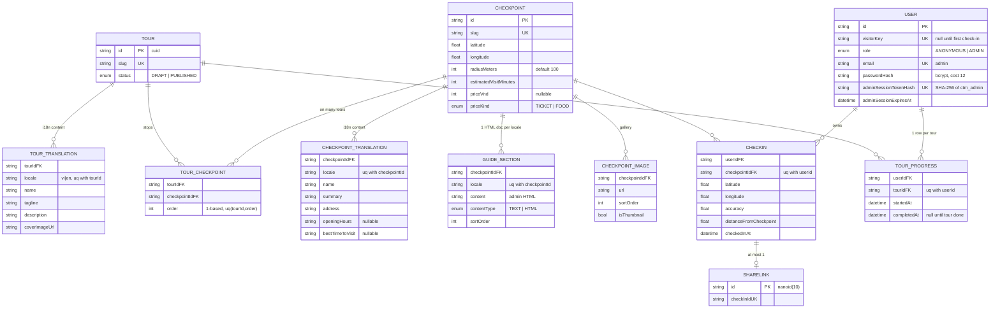
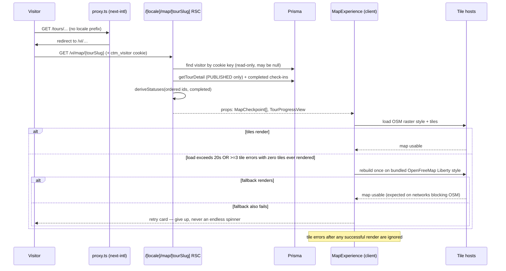
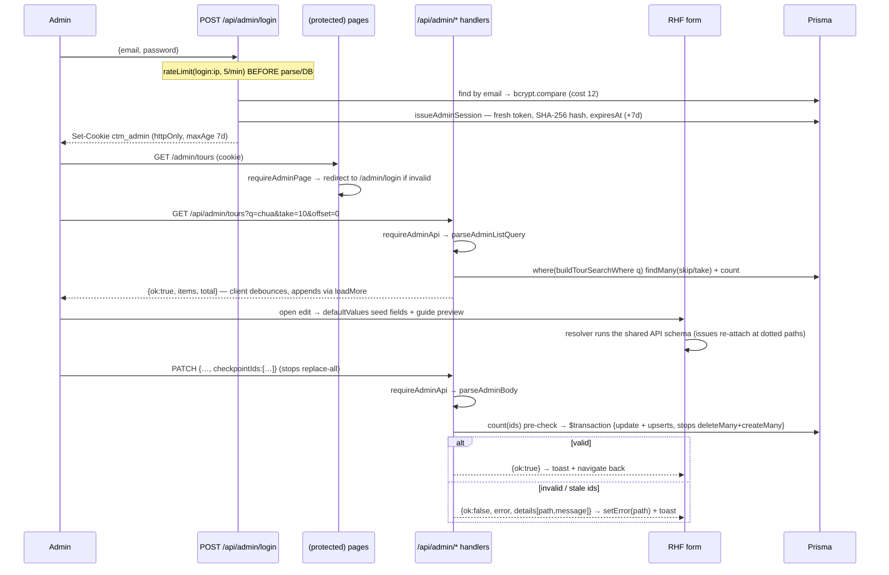

# Logic Map — ChamTrenMap

> Full-surface summary of **business logic and code logic — frontend and backend** — for developers joining the codebase. Every claim points at the file that implements it. Domain vocabulary from [`CONTEXT.md`](../CONTEXT.md); decision records in [`docs/adr/`](adr/); reviews in [`architecture-review.md`](architecture-review.md) and [`security-review.md`](security-review.md).
>
> - **Verified against:** commit `6dbeaec` (main), 2026-09-23
> - **Scope:** every route, service, and component group at medium depth — not a line-by-line walkthrough
> - **Companion ADRs:** 0001 auth split · 0002 unlock derivation · 0003 offset paging · 0004 atomic stop rewrites · 0005 RHF migration

## 0. How to read this doc

1. §1 for orientation, §2 the data model, §3 the rules that must never break.
2. §4 (backend) and §5 (public frontend) are keyed by file path — greppable from here.
3. §7 walks the four golden flows end-to-end (Mermaid); start there if you learn by tracing requests.
4. §9 lists known gaps **on purpose** — do not "fix" them without a decision first.

## 1. System at a glance

**Product:** self-guided tours of Hà Tiên, Vietnam. A visitor opens a tour on an interactive map, walks the ordered stops, and checks in at each by proving GPS proximity (client-reported, **server-validated**). Each completed stop unlocks the next; achievements can be shared via unguessable links. An admin area authors tours, checkpoints, and VN/EN guide articles.

### 1.1 Surfaces

| Surface | URL | Rendering |
|---|---|---|
| Public site | `/[vi\|en]/…` | RSC pages, `force-dynamic`, next-intl |
| Public API | `/api/…` (7 routes) | route handlers → services → Prisma |
| Admin UI | `/admin/…` | server-guarded pages + client forms |
| Admin API | `/api/admin/…` (6 routes) | route handlers → services → Prisma |

`src/proxy.ts` runs the next-intl middleware (matcher excludes `api`, `admin`, `_next`, dotted files): locale prefix always on, default `vi` (`src/i18n/routing.ts`).

### 1.2 Stack in practice

Next.js 16 App Router · TypeScript strict · React 19 · Tailwind 4 + shadcn/ui · next-intl · Prisma 6 / Postgres (Neon) · MapLibre GL · three/@react-three · react-hook-form + Zod 4 · dnd-kit · framer-motion · vitest · Vercel.

**Doc-drift warning:** `README.md` also lists TanStack Query and Zustand — **neither is installed**. Data flow is RSC direct-Prisma reads plus plain `fetch` + React state on the client. Trust `package.json` over the README.

### 1.3 Request pipeline

```
request → proxy.ts (locale)
        → page/layout  (guards → data → render)        [public + admin pages]
        → API route    (rate-limit → auth → parse → service → envelope)
```

All public pages declare `export const dynamic = "force-dynamic"`; cookies (`ctm_visitor`, `ctm_admin`) make admin and progress reads dynamic regardless.
## 2. Domain model

Source of truth: [`prisma/schema.prisma`](../prisma/schema.prisma). The seed (`prisma/seed.ts` + `seed-data.ts`) upserts a demo catalog — **14 checkpoints** (8 landmark + 6 food) across **4 tours**, VN/EN content, guide HTML, and a bcrypt admin from `ADMIN_EMAIL` / `ADMIN_PASSWORD`.



### 2.1 Constraints that *are* business rules

| Constraint | Meaning |
|---|---|
| `CheckIn @@unique([userId, checkpointId])` | one check-in per visitor per stop — the atomic write (Prisma `P2002` → mapped to 409 `ALREADY_CHECKED_IN`) |
| `TourCheckpoint @@unique([tourId, order])` + `@@unique([tourId, checkpointId])` | ordered, duplicate-free stops; makes whole-set rewrites safe (ADR-0004) |
| `TourProgress @@unique([userId, tourId])` | progress is per visitor per tour, upserted lazily on first check-in |
| `ShareLink.checkInId @unique` | a check-in has at most one share link — creation is idempotent |
| `*Translation @@unique([parent, locale])` | exactly one content row per locale → every admin write is an upsert |
| `User.visitorKey @unique` + nullable | write-lazy anonymous identity (ADR-0001): no row until first check-in |

### 2.2 Cascade semantics

Deleting a **Checkpoint** cascades its translations, images, guides, tour links — and, through `CheckIn`, the visitors' check-ins (and their share links). Deleting a **Tour** cascades translations, stop links, and all `TourProgress`. Deleting a **User** cascades their check-ins and progress. The admin DELETE routes rely on these cascades; there is **no soft delete**.
## 3. Business rules (the invariants)

| # | Rule | Enforced in | Tests |
|---|---|---|---|
| R1 | Stops unlock **sequentially**: `completed` → exactly one `current` → `locked` | pure `deriveStatuses` (`src/services/progress-status.ts`); called by `buildProgressView`, `getTourDetail`, the map RSC, and `createCheckIn` | `progress-status.test.ts`, `checkins.service.test.ts` |
| R2 | Check-in gate, evaluated **in order**: not already checked in → not locked → GPS accuracy ≤ 100 m → haversine distance ≤ `radiusMeters` (default 100 m) | `evaluateCheckIn` (`src/lib/geo.ts`), fed by `createCheckIn` (`src/services/checkins.service.ts`) | `geo.test.ts`, `checkins.service.test.ts` |
| R3 | One check-in per visitor per stop | DB unique; `P2002` caught and answered as `ALREADY_CHECKED_IN` | `checkins.service.test.ts` |
| R4 | Tour completes exactly when its last stop is checked in; `completedAt` is stamped **once**, inside the check-in transaction | `src/services/checkins.service.ts` | `checkins.service.test.ts` |
| R5 | Public reads expose **PUBLISHED tours only** | `listTours` / `getTourDetail` (`where: { status: "PUBLISHED" }`); `getTourForCheckpoint` joins only published tours. *Exception noted in §9 (progress endpoint).* | — |
| R6 | Locale fallback for content: requested → `vi` → first row; UI strings mirror it via next-intl (default `vi`) | `pickLocalized` (`src/services/localize.ts`), `src/i18n/request.ts` | `messages.test.ts` |
| R7 | Guide HTML is sanitized on **write and read**; JSON-LD payloads are `<`-escaped (script-breakout-proof) | `src/lib/sanitize.ts` (sanitize-html allowlist), `GuideContent.tsx`, `serializeJsonLd` (`src/lib/jsonld.ts`) | `sanitize.test.ts`, `jsonld.test.ts` |
| R8 | Admin session: token rotates per login, SHA-256 at rest, 7-day absolute expiry, **server-side revocation before cookie clear** | `src/lib/admin-auth.ts` + login/logout routes (ADR-0001) | `admin-auth.test.ts` |
| R9 | Stops payload: ≤ 100 entries, no duplicates, **array order = visit order**; ids validated **before** any write; tour + stops written in one transaction | Zod `checkpointIdsSchema` + both admin tour routes (ADR-0004) | `admin-validation.test.ts` |
| R10 | Rate limits checked **before** parse/DB work: check-in 10/min/IP, login 5/min/IP | `src/lib/rate-limit.ts` + route guards | — (limiter itself untested; `resetRateLimiter()` exists for tests) |
| R11 | Anonymous identity is **write-lazy**: `User` rows appear only on a check-in attempt; read paths never write | `src/lib/visitor-session.ts` (ADR-0001) | `visitor-session.test.ts` |
| R12 | Guide content is **one HTML document per checkpoint + locale** (not sectioned); the admin path always writes `contentType: "HTML"` | `GuideSection.tsx`; field readers in `src/services/checkpoint-content.ts` | `checkpoint-content.test.ts` |
| R13 | Share links: only the **owning** visitor may create one; creation is idempotent (reuses the existing id); ids are `nanoid(10)` | `src/services/share.service.ts` | — |
| R14 | *(Deliberate non-rule)* a tour may be created/edited with **zero stops**, even while `PUBLISHED` | `createTourSchema.checkpointIds` is optional — agreed gap, §9 | — |

Numeric policy constants all live in one file: `src/config/constants.ts` (radius default, accuracy cap, both rate limits, cookie names/TTLs, locales, share-id length).
## 4. Backend

### 4.1 API surface (13 routes)

Every response flows through the one envelope module `src/lib/api.ts` (architecture candidate A — done); both wire contracts are pinned by `tests/api-envelope.test.ts`.

- **Public envelope (typed):** `{ ok: true, data }` / `{ ok: false, error: { code, message, details } }` via `apiOk`/`apiError`. Codes live in `ApiErrorCode` (`BAD_REQUEST`, `UNAUTHORIZED`, `NOT_FOUND`, `NO_TOUR_LINK`, `LOCKED`, `TOO_FAR`, `POOR_ACCURACY`, `ALREADY_CHECKED_IN`, `RATE_LIMITED`, `INTERNAL`). Consumed by `src/lib/api-client.ts` (`fetchApiOk` throws with `code`/`details` attached).
- **Admin envelope (flat adapter):** `{ ok: true, ...entities }` / `{ ok: false, error: string, details?: [{ path, message }] }` via `adminOk`/`adminError`. `details[].path` is the dotted Zod path (`vi.name`) — mapped onto inputs by `toFieldErrors` (`src/lib/admin-form.ts`).

| Method & path | Auth / pre-checks | Validation | Logic → Prisma |
|---|---|---|---|
| `GET /api/tours?locale=` | — | `parseLocale` | `listTours` — PUBLISHED only, stops ordered, sums `estimatedVisitMinutes` |
| `GET /api/tours/[slug]?locale=` | — | `parseLocale` | `getTourDetail` — 404 when not PUBLISHED; statuses optional |
| `GET /api/tours/[slug]/progress` | visitor cookie optional (read-only) | — | `buildProgressView` — derive statuses/percent/current (**no status filter** → §9) |
| `GET /api/checkpoints/[slug]?locale=` | — | `parseLocale` | `getCheckpointDetail` (view mapping in `checkpoint-content.ts`) |
| `POST /api/checkins?locale=` | rate 10/min/IP → write-lazy visitor | `createCheckInSchema` | `createCheckIn`: haversine → `evaluateCheckIn` → tx `{ create CheckIn, upsert TourProgress, stamp completedAt }` → `{ checkIn, progress }`. Errors: 409 `ALREADY_CHECKED_IN`; 422 `NO_TOUR_LINK`/`LOCKED`/`TOO_FAR`/`POOR_ACCURACY` (+ numeric `details`); 404; 429 |
| `GET /api/checkins/me?locale=` | visitor cookie **read-only** | `parseLocale` | `listMyCheckIns` — `[]` when no row exists (never creates one) |
| `POST /api/share/checkin` | visitor cookie required → 403 if absent | `createShareLinkSchema` | `createShareLink` — ownership check, idempotent; URL minted at the default locale (`…/vi/share/checkin/{id}`) |
| `GET /api/admin/tours?q&take&offset` | `requireAdminApi` | `parseAdminListQuery` | `buildTourSearchWhere` + skip/take + `count` → `{ items, total }` (createdAt desc, id asc) |
| `POST /api/admin/tours` | `requireAdminApi` | `createTourSchema` | id pre-check → tx `{ tour + translation creates, createMany stops order=i+1 }`; 409 on duplicate slug |
| `GET/PATCH/DELETE /api/admin/tours/[slug]` | `requireAdminApi` | PATCH: `updateTourSchema` | GET assembles `{ vi, en, stops }`; PATCH: id pre-check → tx `{ update, translation upserts, stops deleteMany+createMany }` (ADR-0004); DELETE relies on cascades |
| `GET/POST /api/admin/checkpoints` | `requireAdminApi` | `parseAdminListQuery` / `createCheckpointSchema` | `listCheckpointsForAdmin` (slug asc) / `createCheckpoint` (guide HTML sanitized) |
| `GET/PATCH/DELETE /api/admin/checkpoints/[slug]` | `requireAdminApi` | PATCH: `updateCheckpointSchema` | via `checkpoint-content.server`; **slug immutable on update**; guides rewritten deleteMany→createMany (sanitized); failures surface as `CheckpointWriteError` → `writeErrorResponse` |
| `POST /api/admin/login` | rate 5/min/IP **first** (before parse/DB) | `loginSchema` | bcrypt compare → `issueAdminSession` (fresh 32-byte token, SHA-256 + expiry on `User`) → set `ctm_admin` (httpOnly, sameSite lax, secure in prod, maxAge 7 d) |
| `POST /api/admin/logout` | cookie | — | `revokeAdminSession` (DB) **then** clear cookie — revocation first, always |
### 4.2 Service layer (`src/services/`)

| Module | Role |
|---|---|
| `tours.service.ts` | public tour list/detail views: folds translations + ordered stops + optional statuses |
| `checkpoints.service.ts` | public detail/list; `getTourForCheckpoint` (first published tour link); `listCheckpointOptions` — **deliberately unbounded** picker data for the admin stop editor (bypasses the list endpoint's `take ≤ 50`, which would silently truncate it) |
| `checkins.service.ts` | the atomic write: load → derive → decide → transaction → progress view; `CheckInResult` union mirrors the API error codes 1:1 |
| `progress.service.ts` | `buildProgressView`, `getCompletedCheckpointIds` (reads); `ensureTourStarted` upsert helper (**defined but currently has no call sites**) |
| `progress-status.ts` | pure `deriveStatuses` (ADR-0002) |
| `share.service.ts` | idempotent share creation + share-page view assembly |
| `localize.ts` | pure `pickLocalized` fallback chain (R6) |
| `checkpoint-content.ts` | shared schemas, view mappers (`toCheckpointDetail/Summary`), `CheckpointWriteError`, and the **field readers** reused by both the server and the RHF resolvers |
| `checkpoint-content.server.ts` | checkpoint admin CRUD + admin list/detail assembly; sanitizes guide HTML on write |
| `search.ts` | pure Prisma WHERE builders for `?q=` (slug OR any locale's name, case-insensitive) |

**Tour admin writes still live inside the routes** — no `tours-admin.server` module and zero tour-write tests yet (architecture candidate **D**, open; see `docs/architecture-review.md`).

### 4.3 Auth & cross-cutting libs (`src/lib/`)

- **`admin-auth.ts`** — ADR-0001 seam: `issueAdminSession` / `verifyAdminToken` (hash + expiry), `requireAdminPage` (redirect → `/admin/login`) for pages and layouts, `requireAdminApi` (401 JSON) for route handlers, `checkLoginRate`. *Note: the 401 it returns uses the **public** envelope shape — see §9.*
- **`visitor-session.ts`** — ADR-0001 seam: `readVisitorId` / `findVisitor` / `getSessionVisitor` (never write); `ensureVisitorWithCookie` (write path only — mints/attaches `ctm_visitor`, 365 d).
- **`rate-limit.ts`** — process-local `Map` with a lazy expiry sweep; trusts the first `x-forwarded-for` hop (documented trusted-proxy assumption; per-instance until a shared store exists — S5 accepted). `resetRateLimiter()` for tests.
- **`api.ts`** — both envelopes + `parseBody` / `parseAdminBody` / `parseLocale` / `parseAdminListQuery` / `handleApiError` / `writeErrorResponse`.
- **`geo.ts`** — `haversineMeters` + the pure `evaluateCheckIn` decision (order: already → locked → accuracy → distance).
- **`sanitize.ts` / `jsonld.ts`** — the two content-safety seams (resolutions of security findings S2 / S4).
- **`weather.ts`** — Open-Meteo client pinned to Hà Tiên's coords; defensive all-or-nothing `parseHatienWeather`, 30-minute `localStorage` cache, stale-cache fallback on failure.
- **`panorama.ts`** — `isLikelyPanorama`: aspect 2:1 ± 8 % **and** width ≥ 1024 → treat the image as equirectangular.
- **`routing.ts`** — OSRM route service (default `router.project-osrm.org`, overridable via `NEXT_PUBLIC_ROUTING_API_URL`; profile `foot`/`driving`).
- **`tour-progress.ts`** — client helpers: `distanceTo` / `isNear` (200 m **UI hint only** — never trusted for check-in) and `applyProgress` (merges a server progress payload into local checkpoint state).
- **`validations/`** — public schemas (`index.ts`: check-in, share, locale) and admin schemas (`admin.ts`: tour create/update, login, list query). Checkpoint schemas live with `checkpoint-content.ts`.
- **`admin-form.ts` / `checkpoint-form.ts`** — envelope → field-error mapping (first message per path wins) and the RHF transform resolvers (§6.4).
## 5. Public frontend

### 5.1 Pages (`src/app/[locale]/`)

| Route | Server data & logic | Client islands |
|---|---|---|
| `/` | `listTours` + `listCheckpoints` → hero `HomeMap`, "how it works" steps, featured tours | map |
| `/tours` | `listTours` → `TourCard` grid (+ empty state) | — |
| `/tours/[slug]` | session → `getCompletedCheckpointIds` → `getTourDetail(…, completedIds)`; progress %; numbered stop timeline colored by status; CTA into the map | `PanoramaViewer` (cover), `TourProgress` |
| `/checkpoints/[slug]` | `getCheckpointDetail` + `getTourForCheckpoint` + checked-in state; summary, badges, guide article, gallery, JSON-LD | `CheckInFlow`, gallery, `QuickStatsCard` |
| `/map/[tourSlug]` | session → completed ids → `getTourDetail` + `deriveStatuses` → assembles `MapCheckpoint[]` and `TourProgressView` props | `MapExperience` (everything below) |
| `/share/checkin/[shareId]` | `getSharePageView` → OG/Twitter metadata + passport-stamp card | `ShareButtons`, `PanoramaViewer` |
| `/dev-map` | map playground page for development | map |

Metadata: per-page `generateMetadata`; the checkpoint page adds canonical + `hreflang` alternates. `src/app/sitemap.ts` (force-dynamic) always emits static entries and DB-backed entries guarded by try/catch (build-without-DB safe). `robots.ts` allows `/`, disallows `/api/`.

### 5.2 Check-in flow (client) — `src/components/checkin/`

State machine `idle → explainer → locating`:

1. The button opens a **permission-explainer dialog before the browser's own prompt** (three "why we ask" reasons).
2. "Allow" → `getCurrentPositionOnce()` (`src/lib/geolocation-client.ts`) → `POST /api/checkins?locale=`.
3. Success → `SuccessModal`: reduced-motion-aware confetti, checkpoint name, `TourProgress`, tour-complete banner, "continue" into the map, and a **Share** button → `POST /api/share/checkin` → `ShareButtons`.
4. Every error code gets specific UX: `TOO_FAR` toast with actual distance vs radius (`formatDistance`), `POOR_ACCURACY` toast with accuracy vs max, `LOCKED` toast, `ALREADY_CHECKED_IN` → friendly dialog carrying the progress payload, anything else → generic toast. Geolocation permission denial gets its own message.

`variant: "food"` swaps copy and labels ("đã ăn" semantics vs. "đã check-in").

### 5.3 Map experience — `src/components/map/`

- **State:** local `useState` only — checkpoints, progress, selection, route, sheet/check-in visibility — all seeded from RSC props and refreshed via `applyProgress` after a check-in. No global store.
- **Location:** `useUserLocation` — Permissions API for state, `watchPosition` (high accuracy, 5 s cache, 15 s timeout).
- **Selection UX:** a side sheet per stop — status icon, live distance (`distanceTo`), OSRM route line + travel-mode toggle, Google-Maps deep link, check-in button shown only for `current` (200 m "near" hint), checked/lock badges otherwise.
- **Tile escalation** — the pure `reduce(state, event)` machine in `map-load.ts` owns `loading → fallback → give-up` plus retry; `MapLibreMap.tsx` only translates MapLibre events and renders state (architecture candidate **C**): primary style is OSM raster (or `NEXT_PUBLIC_MAP_STYLE_URL`); **one** rebuild onto the bundled OpenFreeMap Liberty style when the load exceeds `NEXT_PUBLIC_MAP_LOAD_TIMEOUT_MS` (default 20 s) **or** ≥ 3 tile errors fired with zero tiles ever rendered; after that, give up into a retry card (no endless spinner). Tile errors after any success are ignored. Transitions and event classification are pinned by `tests/map-error.test.ts`.
- **Worker asset:** MapLibre's worker file is copied post-install (`scripts/copy-maplibre-worker.mjs`), asserted by `tests/maplibre-worker-asset.test.ts`.

### 5.4 Checkpoint page details

`CheckpointGallery`; `QuickStatsCard` for food stops; badge row (hours / best time / visit minutes / ticket price) for landmark stops; summary; then **all guide documents** rendered through `GuideContentRenderer` (re-sanitizes on read). JSON-LD `TouristAttraction` injected via `serializeJsonLd`. Note the casing seam: views expose `priceKind` as lowercase `"ticket" | "food"` while the Prisma enum is `TICKET | FOOD` — mapped in `checkpoint-content.ts`.

### 5.5 Panorama — `src/components/three/` + `src/lib/panorama.ts`

`PanoramaViewer` auto-detects equirectangular images (2:1 ± 8 %, ≥ 1024 px wide) and renders a Three.js 360° canvas; otherwise it shows a flat image. Used for tour covers, checkpoint heroes/thumbnails, and the share card. Detection is pure (`tests/panorama.test.ts`).

### 5.6 Weather — `WeatherChip` + `src/lib/weather.ts`

Client chip mounted in `SiteHeader` (alongside `LocaleSwitcher`): fetches Open-Meteo for fixed Hà Tiên coordinates, 7 days, `Asia/Ho_Chi_Minh`; WMO code → icon/kind via `weatherKindForCode`; 30-minute `localStorage` cache; any failure degrades to the stale cache or hides silently. Parser pinned by `tests/weather.test.ts`.

### 5.7 i18n & SEO

`src/messages/{vi,en}.json` — parallel key trees, parity enforced by `tests/messages.test.ts`. Every page calls `setRequestLocale`; `next-intl` middleware in `proxy.ts` handles prefixing/redirects; `LocaleSwitcher` (SiteHeader) round-trips the path. Titles/descriptions/OG per page, sitemap × both locales, canonical + hreflang on checkpoint pages, JSON-LD structured data.

### 5.8 UI kit conventions

`src/components/ui/*` are shadcn primitives; status colors use the `status-{locked,current,completed}` token family; `src/components/form/*` are the shared RHF field wrappers (admin-side; error precedence `serverError ?? peekErrors(...)`, "error replaces hint"); toasts are sonner (`Toaster` in the locale layout).
## 6. Admin (`/admin`)

### 6.1 Auth & shell

- `(protected)/layout.tsx` calls **`requireAdminPage()`** (redirects to `/admin/login`) and renders the nav rail + logout link; `admin/layout.tsx` / `admin/login/page.tsx` handle the signed-out state.
- Login page → `POST /api/admin/login` (flat admin envelope); failures show the human `error` string, 429 included.
- Every `/api/admin/*` handler opens with **`requireAdminApi()`** → 401 when the `ctm_admin` cookie is missing/expired/revoked.

### 6.2 Lists — server search + offset pagination (commit `c247bfa`, ADR-0003)

Both list pages run **`usePaginatedAdminList(endpoint)`** (`src/hooks/usePaginatedAdminList.ts`):

- Contract: `GET endpoint?q=&take=10&offset=N` → `{ ok, items, total }`.
- Search box debounces 300 ms → resets to offset 0 behind a skeleton; `appliedQuery` (trimmed) is the query the visible rows reflect.
- Infinite scroll: IntersectionObserver sentinel (fires ~200 px early) **plus** an explicit "Load more" button (keyboard / IO-less fallback); double-fetch guard + query-epoch rejection of stale responses; a failed page load turns the button into the retry affordance.
- `removeItem(id)` after a confirmed delete keeps `items`, `total`, and the offset consistent without a refetch.
- `items === null` means "first page loading" → skeleton; a first-page failure renders an error card with `retry()`.

### 6.3 Tours

- **Create — `tours/new` + `TourNewForm`:** react-hook-form bridging (ADR-0005): slug, status, vi/en translation blocks, and **stops on create** via the shared `StopsEditor` (commit `6dbeaec`) — drag-to-reorder rows (dnd-kit; keyboard: Space + arrows), combobox fed by `listCheckpointOptions`, resulting array registered as `checkpointIds`. Stops optional/empty allowed (R14). Success → route back to the list.
- **Edit — `tours/[slug]` + `TourEditForm`:** plain component state (never migrated to RHF — deliberate scope line in ADR-0005). PATCH is replace-all on stops (ADR-0004).
- **Delete — `ConfirmDelete` dialog → DELETE → `removeItem`.**
- List rows carry `status` and `checkpointCount` straight from the admin GET payload.

### 6.4 Checkpoints — RHF + shared guide panel (commit `1a46de2`, ADR-0005)

- Field components from `src/components/form/*`; field names are **strings** (`"vi.name"`, `"latitude"`, …); registered values stay strings — coercion happens in `parseCheckpoint*Values`.
- Resolvers (`src/lib/checkpoint-form.ts`) wrap the **same API schemas** the server parses: issues re-attach at their original dotted paths for inline display; the update wrapper re-binds `id`/`slug` (which the schema strips).
- `GuideSection` registers through the page's `FormProvider` and previews via `useWatch` — guide content is part of the form, not sibling state (R12: one HTML doc per locale).
- Server `details`: paths whose root has a registered input (`isCheckpointFormPath`) → `setError` inline; everything else → toast only; first message per field wins (`toFieldErrors` / `formatApiError`).
- Slug input exists **only on create** — slug is immutable on edit (the PATCH route never receives it).

### 6.5 Write-path anatomy

```
form (RHF resolver = shared API schema)
  → fetch POST/PATCH  → route: requireAdminApi → parseAdminBody(schema)
    → service (checkpoint-content.server: sanitize guides, CheckpointWriteError)
      → Prisma (transaction whenever >1 model changes)
  → adminOk({ … }) / adminError(message, status, details[{path,message}])
→ client: details → setError(path) + toast fallback → navigate back / removeItem
```

**Envelope asymmetry to remember:** admin routes answer with the flat envelope, *except* `requireAdminApi`'s 401, which uses the public typed envelope (§9) — an expired session surfaces as an opaque list-load error rather than a login prompt.
## 7. Golden flows

### Flow A — Discovery → interactive map



### Flow B — GPS check-in (the atomic write)

```mermaid
sequenceDiagram
    participant F as CheckInFlow (client)
    participant API as POST /api/checkins
    participant VS as visitor-session
    participant S as checkins.service
    participant DB as Prisma

    F->>F: explainer dialog → browser geolocation prompt → getCurrentPositionOnce
    F->>API: {checkpointId, latitude, longitude, accuracy}?locale=…
    Note over API: rateLimit(checkin:ip, 10/min) BEFORE parse
    alt over limit
        API-->>F: 429 RATE_LIMITED {retryAfterSec}
    end
    API->>API: parseBody(createCheckInSchema)
    API->>VS: ensureVisitorWithCookie (creates User on very first attempt)
    API->>S: createCheckIn(userId, input, locale)
    S->>DB: checkpoint + its tour + ordered stops
    S->>DB: this visitor's existing check-ins on those stops
    S->>S: deriveStatuses → isLocked? → haversineMeters → evaluateCheckIn
    alt decision != ok
        S-->>API: no_tour_link | locked | too_far | poor_accuracy | already_checked_in
        API-->>F: 422/409 + typed code + numeric details
        F-->>U: specific toast or dialog per code
    else ok
        S->>DB: $transaction { create CheckIn; upsert TourProgress; if last stop and completedAt null → stamp }
        Note over DB: unique(userId, checkpointId) — concurrent duplicate → P2002 → mapped to already_checked_in
        S-->>API: {checkIn, progress}
        API-->>F: 200 {ok:true, data}
        F->>F: SuccessModal (confetti, TourProgress, share CTA)
    end
```
### Flow C — Progress read + share

```mermaid
sequenceDiagram
    participant P as Tour/Map RSC or GET /api/tours/[slug]/progress
    participant DB as Prisma
    participant M as Client UI
    participant SH as POST /api/share/checkin
    participant V as /[locale]/share/checkin/[shareId]

    P->>DB: visitor (cookie, read-only — may be null) + tour + check-ins
    P->>P: deriveStatuses → completedCount / percent / current / isCompleted
    P-->>M: TourProgressView (applyProgress merges updates after each check-in)
    M->>SH: {checkInId} (+ cookie; 403 without it)
    SH->>DB: checkIn ownership check (userId must match)
    SH->>DB: shareLink exists? reuse its id : create nanoid(10)
    SH-->>M: {shareId, url} → ShareButtons
    V->>DB: getSharePageView (checkpoint + tour i18n, thumbnail)
    V-->>M: stamp card + OG/Twitter metadata for crawlers
```

### Flow D — Admin CMS (login → search → edit → persist)


## 8. Test map (`tests/`, vitest)

| File | What it pins |
|---|---|
| `api-envelope.test.ts` | both wire contracts (public typed + admin flat) |
| `admin-auth.test.ts` · `visitor-session.test.ts` | auth seams with mocked Prisma (ADR-0001) |
| `geo.test.ts` | haversine + the `evaluateCheckIn` decision matrix |
| `checkins.service.test.ts` | full check-in service: decisions, transaction, completion |
| `progress-status.test.ts` · `tour-progress.test.ts` | derivation rules + client merge helpers |
| `admin-validation.test.ts` | Zod schemas incl. the stops contract and list-query bounds |
| `search.test.ts` | exact Prisma WHERE shapes for `?q=` |
| `checkpoint-content.test.ts` | write service, view mappers, field readers |
| `checkpoint-form.test.ts` | RHF resolver payloads + issue-path re-attachment |
| `form-peek-errors.test.ts` | dotted-path error lookup |
| `sanitize.test.ts` · `jsonld.test.ts` | XSS corpus + `</script>` breakout corpus |
| `map-error.test.ts` · `maplibre-worker-asset.test.ts` | escalation deciders; worker-file copy |
| `panorama.test.ts` · `weather.test.ts` | equirectangular detection; Open-Meteo parser |
| `messages.test.ts` | vi/en message-key parity |

Commands: `npm test` (vitest run). Ship gates used so far: `tsc --noEmit` · `eslint` · `vitest run` · `next build`.

## 9. Known gaps & accepted limitations

**Agreed out of scope (do not silently add):**

1. No "PUBLISHED requires ≥ 1 stop" rule — empty published tours are possible (R14, ADR-0004).
2. No unsaved-changes guard on the tour create form.
3. No route-level integration tests — everything is unit/service level with mocked Prisma.

**Observations recorded while mapping (fix only via a new decision):**

- `GET /api/tours/[slug]/progress` does **not** filter `status = PUBLISHED`, unlike every other public tour read — knowing a DRAFT tour's slug yields its progress shape.
- `requireAdminApi`'s 401 uses the public envelope, not `adminError` — an expired admin session surfaces as an opaque list-load error instead of a redirect/login prompt.
- Tour admin writes have no service module and no tests (architecture candidate **D** open); map load orchestration is still inline rather than a reducer (candidate **C** open).
- `ensureTourStarted` in `progress.service.ts` currently has no call sites.

**Security-review carry-overs** (see `docs/security-review.md`): S8 CSP still open (baseline headers shipped); S10 password policy `.min(1)` accepted (env-provided password); S5 in-memory rate limiter is per-instance (accepted single-node assumption).

**Doc drift:** `README.md`'s tech stack lists TanStack Query and Zustand — not installed, not used (§1.2).

## 10. Conventions cheat-sheet

- **Strings in forms, numbers in payloads** — RHF values are strings; coercion happens once, in the field readers / Zod `coerce`.
- **Dotted error paths everywhere** — `vi.name`, `guide.vi.content`: server `details[].path`, client `peekErrors` / `setError` share one vocabulary.
- **Error replaces hint; first message per field wins.**
- **Two envelopes, one module** — `apiOk`/`apiError` (public, coded) or `adminOk`/`adminError` (admin, human string); never build JSON responses inline in routes.
- **Reads never create rows** — visitor identity is written only in the check-in POST (ADR-0001).
- **Sanitize at the seam** — anything reaching `dangerouslySetInnerHTML` passes `sanitizeHtml`; anything reaching `<script type="application/ld+json">` passes `serializeJsonLd`.
- **Order is data** — the stops array in admin payloads, `TourCheckpoint.order` in the DB, and the input order of `deriveStatuses` must stay aligned.
- **Pure deciders** — keep side-effect-free cores (geo, statuses, map actions, search WHERE builders) extracted and testable; new rules belong there first.
- **i18n parity** — every message key must exist in *both* `vi.json` and `en.json` or `tests/messages.test.ts` fails.

---
*Produced by the `grill-with-docs` skill (grilling → domain-modeling). Update this file when routes, services, or rules move; `docs/adr/` records why they are the way they are.*
